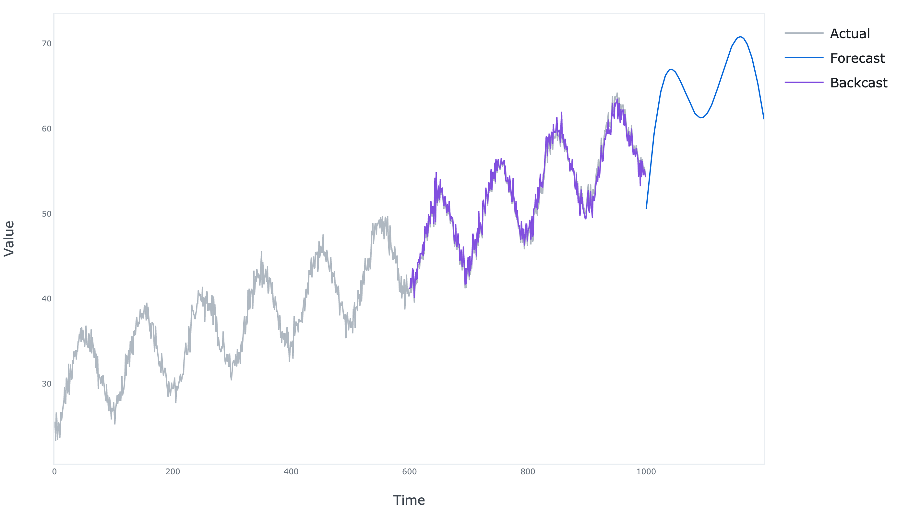

# N-BEATS TensorFlow

TensorFlow implementation of univariate time series forecasting model introduced in *European machine learning and data mining conference.*
AA-Forecast: Anomaly-Aware Forecast for Extreme Events

Credit goes to: https://github.com/flaviagiammarino for majority of the work.
## Dependencies
```bash
pandas==1.5.2
numpy==1.23.5
tensorflow==2.11.0
plotly==5.11.0
kaleido==0.2.1
```

## Usage
```python
import numpy as np

from aaforecast_tensorflow.model import aaforecast
from aaforecast_tensorflow.plots import plot

# Generate a time series
N = 1000
t = np.linspace(0, 1, N)
trend = 30 + 20 * t + 10 * (t ** 2)
seasonality = 5 * np.cos(2 * np.pi * (10 * t - 0.5))
noise = np.random.normal(0, 1, N)
y = trend + seasonality + noise

# Fit the model
model = aaforecast(
    y=y,
    forecast_period=200,
    lookback_period=400,
    units=30,
    stacks=['trend', 'seasonality'],
    num_trend_coefficients=3,
    num_seasonal_coefficients=5,
    num_blocks_per_stack=2,
    share_weights=True,
    share_coefficients=False,
)

model.fit(
    loss='mse',
    epochs=100,
    batch_size=32,
    learning_rate=0.003,
    backcast_loss_weight=0.5,
    verbose=True
)

# Generate the forecasts and backcasts
df = model.forecast(y=y, return_backcast=True)

# Plot the forecasts and backcasts
fig = plot(df=df)
fig.write_image('results.png', scale=4, width=700, height=400)
```

